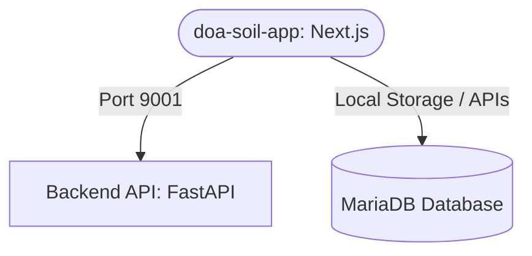

<!-- BEGIN:nextjs-agent-rules -->
# This is NOT the Next.js you know

This version has breaking changes — APIs, conventions, and file structure may all differ from your training data. Read the relevant guide in `node_modules/next/dist/docs/` before writing any code. Heed deprecation notices.
<!-- END:nextjs-agent-rules -->

# Doa Soil App - Next.js & System Architecture Knowhow

This guide documents the architecture, dependencies, and connections between the **Next.js Frontend** (`doa-soil-app`) and the **Docker Backend** (`soil_nutrient-main`).

## Project Overview

* **Frontend**: Next.js 16.2.7 (App Router, React 19, Tailwind CSS v4, TypeScript)
* **Backend**: FastAPI (Python 3.10) + MariaDB + PyTorch CPU
* **Design & Theme**: Premium Light Theme with Noto Sans Thai / Inter typography, rounded corners, custom progress bars, and glassmorphism.

---

## Directory Structure

```
doa-soil-app/
├── src/
│   ├── app/                # Next.js pages and routes
│   │   ├── analyze/        # Soil analysis flows (automatic photo upload / manual inputs)
│   │   ├── dashboard/      # History analytics & statistics
│   │   ├── login/          # User authentication screens
│   │   ├── profile/        # Profile edit and password reset
│   │   └── layout.tsx      # Core application layout
│   ├── components/         # Reusable UI components (ui/Button, TermsModal)
│   ├── lib/                # Storage utilities, mock data, translations
│   └── types/              # TS interface definitions
```

---

## Integration with Docker Backend Services

The backend and database services are hosted in the sister repository `soil_nutrient-main` under Docker Compose.



### 1. API Connection
* **FastAPI Backend Endpoint**: `http://localhost:9001`
* **Prediction APIs**:
  * `/predict_om` (Organic Matter)
  * `/predict_k` (Potassium)
  * `/predict_p` (Phosphorus)
* **API Details**: Receives an uploaded soil color plate image, crops/preprocesses it, runs it through PyTorch models, and returns JSON containing predicted value, raw predicted float, and the cropped base64 image.

### 2. Database & Data Backups
* **Database**: MariaDB 10.6.
* **SQL Seed File**: The official DB dump `db_backup.sql` containing schemas, user roles, and historical records is located inside `/Users/popia./Downloads/drive-download-20260408T020715Z-3-001.zip`.
* **Import Command**:
  ```bash
  docker compose exec -T db mysql -uadmin -ppassword soil < path/to/db_backup.sql
  ```

---

## Development Commands

```bash
# Install dependencies
bun install   # or npm install

# Start Next.js Development Server
npm run dev
# URL: http://localhost:3000
```
