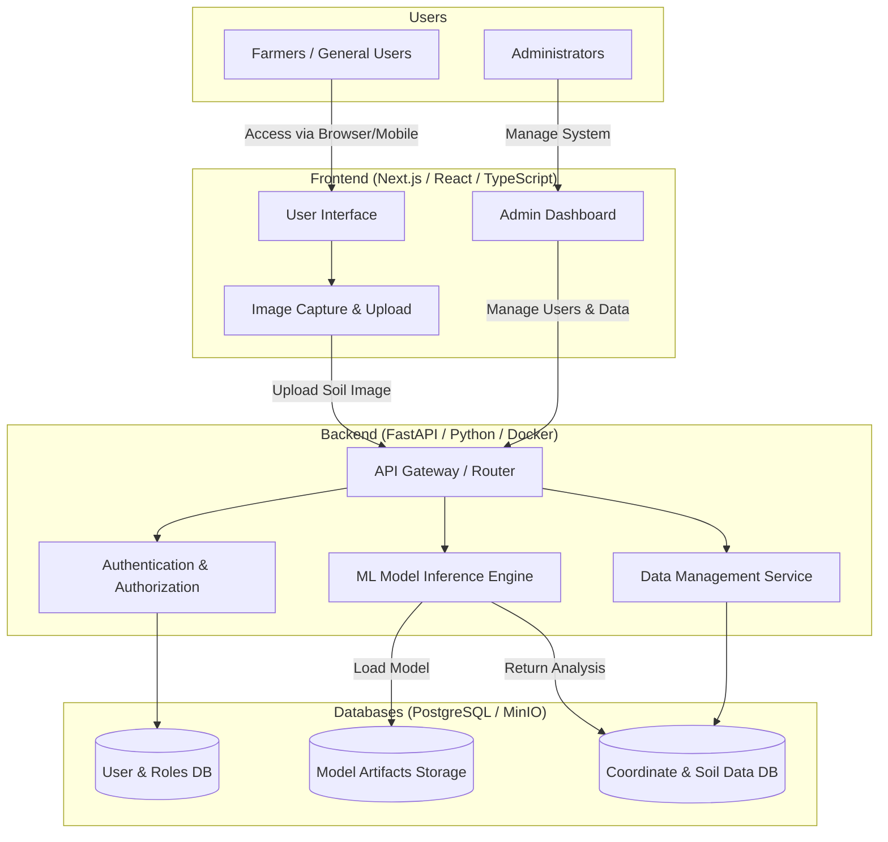

# Soil Nutrient System - Conceptual Architecture

This document outlines the conceptual architecture for the Soil Nutrient testing system. It maps out the key components including the web interface, backend inference engine, and database systems.

## Architecture Diagram

## Components Description

1. **Users**
   - **Farmers / General Users:** Access the web application to capture or upload soil images for nutrient analysis.
   - **Administrators:** Use the admin dashboard to manage user roles, view aggregate data, and monitor system health.

2. **Frontend (หน้าบ้าน)**
   - **Frameworks:** Next.js / React / TypeScript (doa-soil-app)
   - Handles the user interface, image capturing/uploading, and presents the analysis results to the user.

3. **Backend Services (หลังบ้าน)**
   - **Frameworks:** FastAPI (Python) / Docker
   - Containerized for high performance and easy deployment.
   - **API Gateway:** Routes incoming requests from the frontend.
   - **Inference Engine:** Processes the uploaded soil images using the underlying ML models in Python.
   - **Authentication:** Manages user login sessions and role-based access control.
   - **Data Management:** Handles reading and writing structured data.

4. **Databases (ระบบฐานข้อมูล)**
   - **Frameworks:** PostgreSQL (or similar relational DB), MinIO/S3 (for artifacts)
   - **User & Roles DB:** Stores user accounts, encrypted passwords, and role definitions.
   - **Coordinate & Soil Data DB:** Stores geographical data (coordinates) and the results of the soil nutrient analysis.
   - **Model Store:** A storage location for the machine learning model weights/artifacts (e.g., Object Storage like MinIO or AWS S3).
